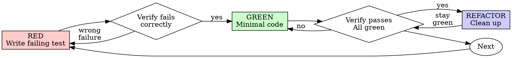

# Test-Driven Development (TDD)

## Overview

Write the test first. Watch it fail. Then write the minimum code required to make it pass.

**Core principle:** If you did not watch the test fail first, you do not know whether it verifies the intended behavior.

**Violating the letter of these rules violates the spirit of TDD.**

## When to Use

**Always use TDD for:**
- New features
- Bug fixes
- Refactoring
- Behavior changes

**Exceptions require your human partner's approval:**
- Throwaway prototypes
- Generated code
- Configuration-only changes

If you catch yourself thinking "just this once," stop. That is rationalization.

## The Iron Law

```text
NO PRODUCTION CODE WITHOUT A FAILING TEST FIRST
```

If you wrote production code before the test:
- Delete it
- Do not keep it as reference
- Do not adapt it into the final implementation
- Start over from the failing test

Delete means delete.

## The Cycle: Red → Green → Refactor



### RED — Write a Failing Test

Write one minimal test that expresses one behavior.

<Good>
```typescript
test('retries failed operations 3 times', async () => {
  let attempts = 0;
  const operation = () => {
    attempts++;
    if (attempts < 3) throw new Error('fail');
    return 'success';
  };

  const result = await retryOperation(operation);

  expect(result).toBe('success');
  expect(attempts).toBe(3);
});
```
Clear name. Real behavior. One responsibility.
</Good>

<Bad>
```typescript
test('retry works', async () => {
  const mock = jest.fn()
    .mockRejectedValueOnce(new Error())
    .mockRejectedValueOnce(new Error())
    .mockResolvedValueOnce('success');
  await retryOperation(mock);
  expect(mock).toHaveBeenCalledTimes(3);
});
```
Vague name. Tests the mock setup more than the behavior.
</Bad>

**Requirements:**
- Test one behavior
- Use a clear, behavior-based name
- Prefer real code over mocks unless mocks are unavoidable

### VERIFY RED — Watch It Fail

**Mandatory. Never skip this step.**

```bash
npm test path/to/test.test.ts
```

Confirm all of the following:
- The test fails, not errors
- The failure message matches expectations
- It fails because the behavior is missing, not because of a typo or setup problem

If the test passes immediately, you are testing existing behavior or wrote the test too late.

If the test errors, fix the test until it fails for the correct reason.

### GREEN — Write the Minimum Code

Write the simplest code that makes the test pass.

<Good>
```typescript
async function retryOperation<T>(fn: () => Promise<T>): Promise<T> {
  for (let i = 0; i < 3; i++) {
    try {
      return await fn();
    } catch (e) {
      if (i === 2) throw e;
    }
  }
  throw new Error('unreachable');
}
```
Just enough to pass.
</Good>

<Bad>
```typescript
async function retryOperation<T>(
  fn: () => Promise<T>,
  options?: {
    maxRetries?: number;
    backoff?: 'linear' | 'exponential';
    onRetry?: (attempt: number) => void;
  }
): Promise<T> {
  // YAGNI
}
```
Over-designed. Solves problems the test did not ask for.
</Bad>

Do not:
- Add extra features
- Refactor unrelated code
- Improve things "while you're here"

### VERIFY GREEN — Watch It Pass

**Mandatory.**

```bash
npm test path/to/test.test.ts
```

Confirm:
- The new test passes
- Existing tests still pass
- Output is clean, with no unexpected warnings or errors

If the test fails, fix the code, not the test.

If other tests fail, resolve that immediately.

### REFACTOR — Clean Up

Only refactor after green.

Allowed refactoring:
- Remove duplication
- Improve naming
- Extract helpers
- Simplify structure

Do not change behavior during refactor.

Keep the test suite green at every step.

### REPEAT

Write the next failing test for the next behavior.

## What Good Tests Look Like

| Quality | Good | Bad |
|---------|------|-----|
| **Minimal** | Tests one behavior | Tests multiple behaviors in one test |
| **Clear** | Name describes expected behavior | `test('test1')` |
| **Intentional** | Shows the intended API and outcome | Obscures what the system should do |

Rule of thumb: if the test name contains "and," it probably needs to be split.

## Why the Order Matters

### "I'll write tests after the code"

A test written after implementation often passes immediately. That proves very little.

It may:
- Verify the wrong thing
- Mirror the implementation instead of the requirement
- Miss important edge cases
- Fail to catch the original bug

Test-first proves the test can detect missing behavior.

### "I already manually tested it"

Manual testing is not systematic.

It gives you:
- No repeatable record
- No automatic regression protection
- No reliable coverage under pressure

Automated tests run the same way every time.

### "Deleting hours of work is wasteful"

That is sunk-cost thinking.

The real choice is:
- Rewrite with TDD and gain confidence
- Keep unverified code and carry risk forward

The waste is not deleting bad code. The waste is keeping code you cannot trust.

### "TDD is dogmatic; being pragmatic means adapting"

TDD is pragmatic because it:
- Finds bugs before commit
- Prevents regressions
- Documents intended behavior
- Makes refactoring safer

Shortcuts feel faster until debugging starts.

### "Tests after achieve the same goal"

They do not.

Tests-after answer:
- "What does this implementation do?"

Tests-first answer:
- "What should this code do?"

That difference matters.

## Common Rationalizations

| Excuse | Reality |
|--------|---------|
| "Too simple to test" | Simple code still breaks. |
| "I'll test after" | A test that passes immediately proves little. |
| "Tests after are basically the same" | They are not. |
| "I already manually tested it" | Manual testing is not repeatable. |
| "Deleting work is wasteful" | Keeping unverified code is technical debt. |
| "I'll keep it as reference" | You will adapt it. That is still test-after. |
| "I need to explore first" | Explore if needed, then throw it away and restart with TDD. |
| "Testing is hard here" | Hard-to-test design often means hard-to-use design. |
| "TDD slows me down" | Debugging later is slower. |
| "Existing code has no tests" | Then improve it by adding tests now. |

## Red Flags — Stop and Start Over

If any of these are true, stop and restart with TDD:

- Production code exists before the test
- The test was added after implementation
- The test passed immediately
- You cannot explain why the test failed
- Tests were deferred until "later"
- You are rationalizing an exception
- You already manually tested and think that is enough
- You are keeping earlier code as "reference"
- You are unwilling to delete unverified code

## Example: Bug Fix

**Bug:** Empty email is accepted

### RED
```typescript
test('rejects empty email', async () => {
  const result = await submitForm({ email: '' });
  expect(result.error).toBe('Email required');
});
```

### VERIFY RED
```bash
$ npm test
FAIL: expected 'Email required', got undefined
```

### GREEN
```typescript
function submitForm(data: FormData) {
  if (!data.email?.trim()) {
    return { error: 'Email required' };
  }
  // ...
}
```

### VERIFY GREEN
```bash
$ npm test
PASS
```

### REFACTOR
Extract shared validation only if needed, and only after tests are green.

## Verification Checklist

Before marking work complete:

- [ ] Every new behavior has a test
- [ ] Every test was observed failing before implementation
- [ ] Each test failed for the expected reason
- [ ] Only the minimum code was written to pass
- [ ] All relevant tests pass
- [ ] Output is clean
- [ ] Real behavior is tested wherever possible
- [ ] Edge cases and error cases are covered

If you cannot check every box, you did not follow TDD.

## When Stuck

| Problem | Response |
|---------|----------|
| Do not know how to test it | Write the API you wish existed. Start from the assertion. Ask your human partner if needed. |
| Test is too complicated | The design may be too complicated. Simplify it. |
| Everything must be mocked | The code is probably too coupled. Reduce coupling. |
| Test setup is huge | Extract helpers. If still too large, simplify the design. |

## Debugging Integration

When a bug is found:
1. Reproduce it with a failing test
2. Follow the TDD cycle
3. Keep the test as regression protection

Never fix a bug without a test.

## Testing Anti-Patterns

When writing or changing tests, read `testing-anti-patterns.md`.

Watch for:
- Testing mock behavior instead of real behavior
- Adding test-only methods to production code
- Mocking dependencies without understanding them

## Final Rule

```text
Production code requires a test that existed first and failed first.
Otherwise, it is not TDD.
```

No exceptions without your human partner's permission.
